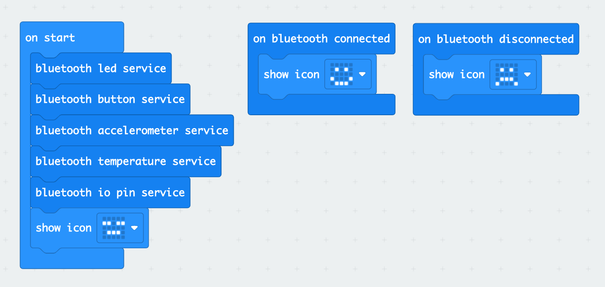
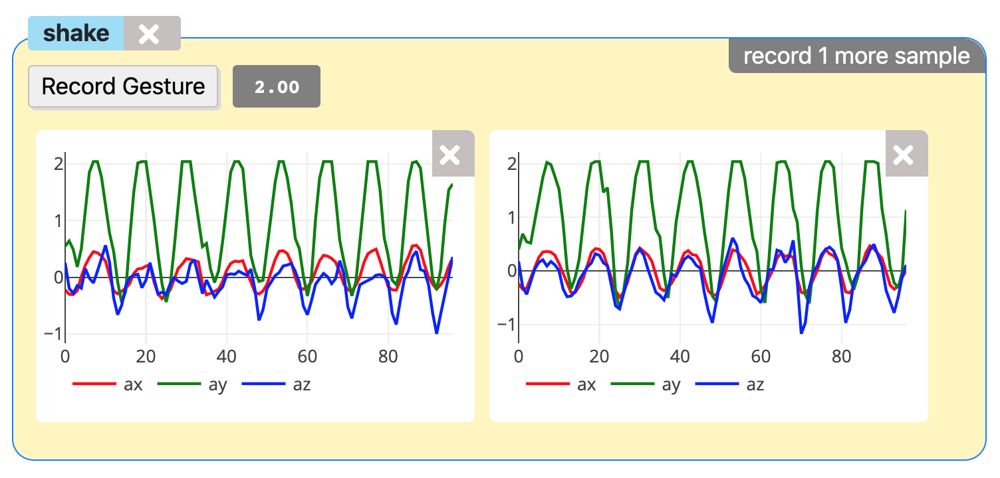
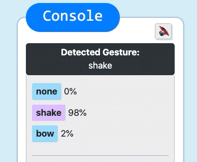

# Microbit Gesture Recognizer

A gesture recognition tool using the Microbit's accelerometer, built using [ml5js](https://learn.ml5js.org/#/reference/neural-network).  Ml5js is built on top of [TensorFlow.js](https://www.tensorflow.org/js).

## Instructions
1. Load [this Hex file](https://raw.githubusercontent.com/ttseng/plushie/master/firmware/plushie.hex) onto your Microbit.  The firmware is setup so that the Microbit can continually stream accelerometer data via bluetooth.

2. Open up the [Gesture Recognizer app](https://ttseng.github.io/plushie/gesture/) in a Chrome browser (full info on system requirements for Web BLE [here](https://github.com/WebBluetoothCG/web-bluetooth/blob/gh-pages/implementation-status.md)).
3. Click `Pair Your Microbit.`  If your Microbit is successfully paired, you should see a smiley face on the Microbit's LED array.
4. `+ Add New Gesture` to record samples of your gesture.  You have 2 seconds to record each sample, and there is a 3 second lead-in countdown.  You'll be able to view the x, y, and z accelerometer plot after each sample and remove individual samples as needed.

5. When you have at least 3 samples of 2 or more gestures, click `Train Model` to build the machine learning model.
6. After the model is trained, you can test out the gesture recognizer.

## Tips
* If you find that a paticular gesture is not being recognized accurately, you can add more samples to see if the model improves, or you can adjust the `confidence threshold` based on the prediction percentage values you see in the console. 

## The ML Model
The ML model is a neural network with 8 distinct inputs, all captured over a 2 second sample
* `ax_max` - the max accelerometer value for the x axis
* `ax_min` - the min accelerometer value for the x axis
* `ax_std` - the standard deviation of the accelerometer for the x axis
* `ax_peaks` - the number of positive peaks for the accelerometer for the x axis
* `ay_max` 
* `ay_min`
* `ay_std`
* `ay_peaks`
* `az_max`
* `az_min`
* `az_std`
* `az_peaks`

When predicting gestures from live data, the application takes 2 second samples from incoming data and runs a prediction based on the trained gestures.

The Debugging interface lets you see how the model performs based on 10 seconds of data and can be accesssed by clicking `Debug last 10 seconds` after the model has been trained.
